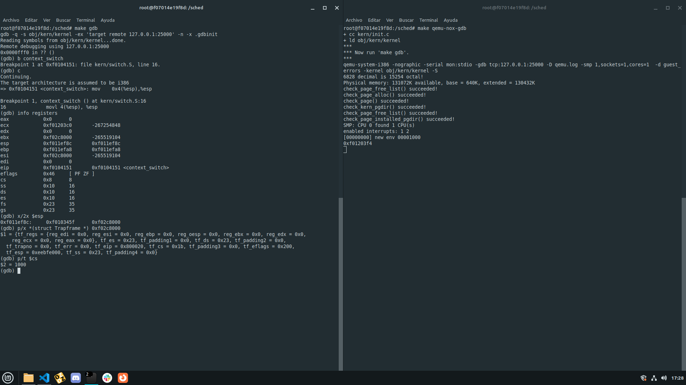
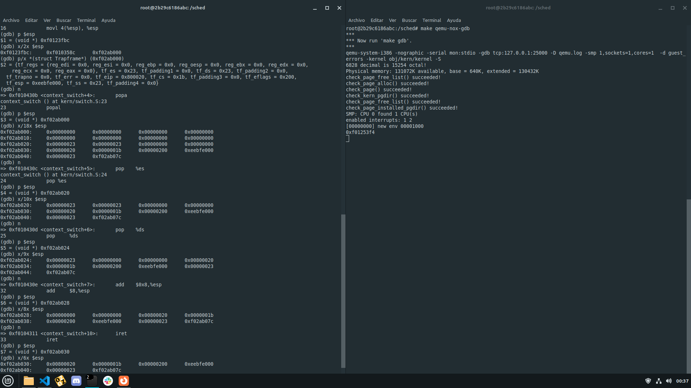
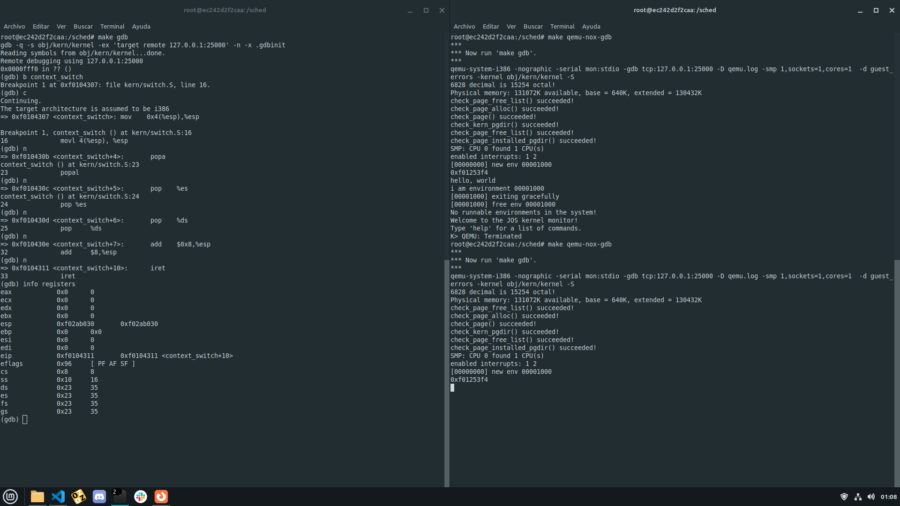
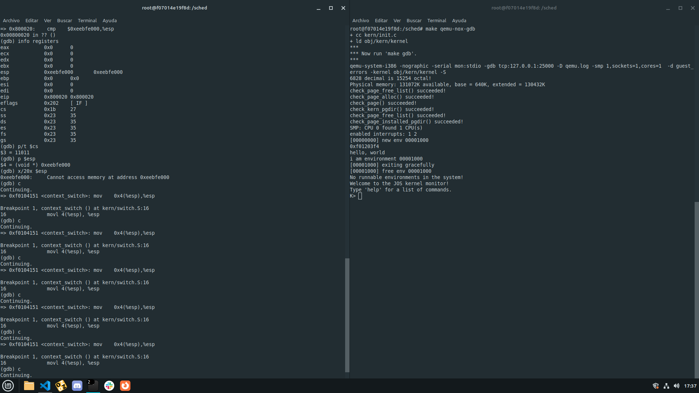
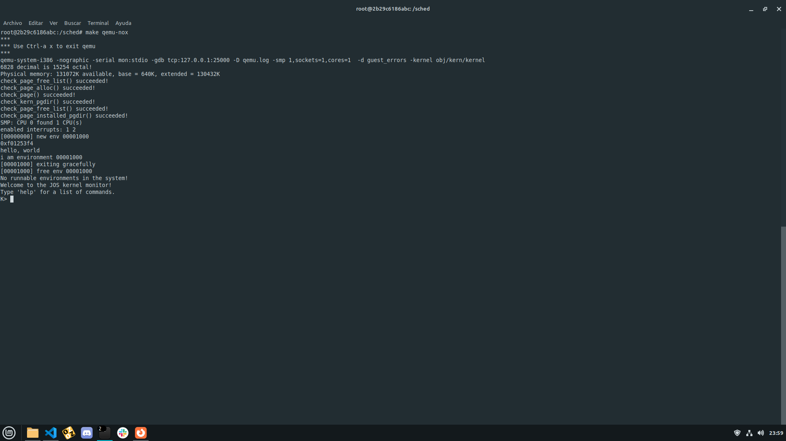

# sched

## Cambio de contexto 

###  De modo kernel a modo usuario

En la primera captura:

- Puede verse el estado de los registros al ingresar a la función context_switch.
- Se puede ver que stack apunta al puntero de la dirección de retorno la función, y tiene luego de esos 4 bytes un puntero al trapframe.
- Los dos bits menos significativos el code segment indican el privilege level y son 0, por lo que estamos en kernel mode.

Luego, se muestra el estado del stack instrucción a instrucción. Se puede ver que tras la primera ya apunta al trapframe, y luego de cada pop van quedando menos cosas del mismo.

Antes de ejecutar iret, puede verse que en se guardaron bien los registros del trapframe.

Luego de iret (se hace el cambio de contexto), los registros se mantienen, y el code segment tiene sus dos bits menos significativos en 1, lo que indica que estamos en user mode. 

Además, se ve que hay varios cambios de contexto antes de que se termine de ejecutar hello_user.

###  De modo usario a modo kernel

Se muestra en la siguiente imagen que user_hello funciona.

## Round Robin

Busca el primer proceso que esté listo para correr (env_status == ENV_RUNNABLE),
empezando por el primero después del actual y lo ejecuta. Si no se encontró ningún proceso 
para ejecutar y el proceso actual sigue corriendo (env_status == ENV RUNNING) se elige el 
proceso actual para ejecutar, si no, se detiene la CPU.

## Scheduler con prioridades

Para el scheduler con prioridades elegimos hacer algo parecido a una MLFQ pero en lugar de usar colas, cada proceso 
tiene un número de prioridad asociado, siendo 0 la mejor prioridad y 6 la peor.

El proceso a ejecutar se selecciona buscando, a partir del proceso actual y entre los procesos listos para correr,
a aquel proceso con mejor prioridad. Al igual que el Round Robin, si no se encuentra ningún proceso para ejecutar 
y el proceso actual sigue corriendo, se lo elige a este para ejecutar, si no, se detiene la CPU.

Todo proceso empieza con prioridad máxima (0) y cada vez que lo ejecuta el scheduler una cierta cantidad de veces 
(3 en nuestro caso), lo cual usamos como una simplificación del concepto de “time slice”, baja su prioridad hasta 
llegar a la mínima (6). Para evitar el problema de starvation, que ocurre cuando hay demasiadas tareas interactivas
en el sistema que se combinan para consumir todo el tiempo del CPU causando que las tareas de larga duración nunca 
se ejecuten, cada una cierta cantidad de llamadas al scheduler (24 en nuestro caso) se aplica un “boost” que consiste
en resetear todas las prioridades a 0.

Cuando un proceso hace fork, la prioridad del proceso creado es la misma que tenía el que hizo la llamada a la syscall.

Los valores de prioridad mínima y de los límites de llamadas fueron elegidos a partir de pruebas con varias 
combinaciones distintas de cantidad y tipos de procesos (modificando el archivo init.c, agregando procesos creados por
nosotros y algunos ya presentes en el esqueleto). Consideramos que para que los procesos bajen de prioridad
adecuadamente, no muy rápido ni muy lento, y que los procesos de larga duración efectivamente tengan baja prioridad 
pero que eventualmente sí se ejecuten, los valores elegidos fueron los que nos parecieron adecuados. 

